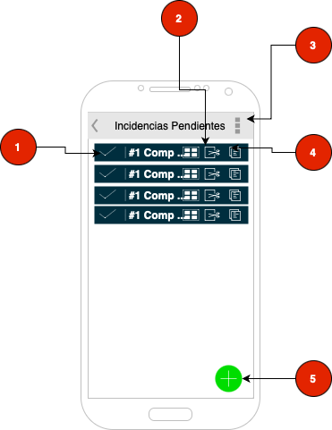

# app Gestionador de Incidencias

*Autor:* Fabián Mauricio Castrillón

Permite administrar las incidencias que usuarios finales agregan a la
aplicación para poder ser gestionadas, administradas y poderles hacer seguimiento.

1. Se muestra los estados en el que se encuentra la incidencia.
    - Estado
    - Pendiente
    - Asignado
    - En Proceso
    - Finalizado

2. Botón para cambio de estado:

- Cuando esta en estado Pendiente  y se le da click, mostrar el formulario para asignar Funcionario

- Cuando esta en estado Asignado y se le da click, preguntar si se va a activar el proceso y si la respuesta es si, cambiar el estado a  En proceso, guardar fecha y hora, funcionario, y localización de GPS

- Cuando esta en estado En Proceso y se le da click, abrir el formulario para capturar evidencias

3. Muestras las opciones del menú principal (Menú hamburguesa)

4. Ver Incidencia: cuando se le da clic mostrar formulario / pantalla con los datos de la incidencia, los datos de la atención, entre otros

5. Agregar incidencia: Cuando se le de click se muestra el formulario / pantalla que solicita la información para una nueva incidencia